# 🗄️ Database Schema Diagram - Fingerprint Time Logger

> **Updated**: 2025-07-02 - Reflects unified Employee model after migration 6285b7d1c7eb

## 📊 Entity Relationship Diagram

```mermaid
erDiagram
    %% Core Entities
    DEVICES {
        int id PK "Primary Key"
        string name "Device Name"
        string ip_address "IP Address"
        int port "Port (default 4370)"
        int password "Device Password"
        boolean is_active "Active Status"
        datetime last_sync "Last Sync Time"
        datetime created_at "Created Timestamp"
        datetime updated_at "Updated Timestamp"
    }

    EMPLOYEES {
        int id PK "Primary Key"
        string badge_number UK "Unique Badge Number"
        string english_name "English Name"
        string thai_name "Thai Name"
        string display_name "Display Name (Computed)"
        string department "Department"
        string position "Position"
        int job_role_id FK "Job Role Reference"
        boolean is_active "Active Status"
        boolean is_hidden "Hidden from View"
        datetime created_at "Created Timestamp"
        datetime updated_at "Updated Timestamp"
    }

    JOB_ROLES {
        int id PK "Primary Key"
        string role_name UK "Role Name"
        string display_name "Display Name"
        text description "Role Description"
        boolean has_shifts "Has Shift Schedule"
        boolean is_active "Active Status"
        datetime created_at "Created Timestamp"
        datetime updated_at "Updated Timestamp"
    }

    %% Attendance System
    ATTENDANCE_RECORDS {
        int id PK "Primary Key"
        string employee_badge_number FK "Employee Badge Number"
        int device_id FK "Device Reference"
        datetime timestamp "Punch Timestamp"
        int punch_type "0=in, 1=out, 2=break_out, etc"
        int status "0=normal, 1=late, 2=early"
        string sync_status "Sync Status"
        string local_id "Local UUID"
        boolean created_locally "Created Offline"
        string validation_status "Validation Result"
        int lateness_minutes "Late Minutes"
        int early_minutes "Early Minutes"
        time expected_time "Expected Time"
        string schedule_type "Schedule Type"
        text validation_message "Validation Message"
        datetime validated_at "Validation Time"
        datetime created_at "Created Timestamp"
    }

    %% Work Schedule System
    WORK_SCHEDULES {
        int id PK "Primary Key"
        int job_role_id FK "Job Role Reference"
        time start_time "Work Start Time"
        time end_time "Work End Time"
        json working_days "Working Days Array"
        int break_duration_minutes "Break Duration"
        boolean is_active "Active Status"
        datetime created_at "Created Timestamp"
        datetime updated_at "Updated Timestamp"
    }

    WORK_SHIFTS {
        int id PK "Primary Key"
        int job_role_id FK "Job Role Reference"
        string shift_name "Shift Name"
        time start_time "Shift Start Time"
        time end_time "Shift End Time"
        string color "Display Color (Hex)"
        json working_days "Working Days Array"
        int break_duration_minutes "Break Duration"
        int sort_order "Display Order"
        boolean is_active "Active Status"
        boolean is_overnight "Overnight Shift"
        datetime created_at "Created Timestamp"
        datetime updated_at "Updated Timestamp"
    }

    EMPLOYEE_MONTHLY_SCHEDULES {
        int id PK "Primary Key"
        string employee_badge_number "Employee Badge"
        int job_role_id FK "Job Role Reference"
        int year "Schedule Year"
        int month "Schedule Month"
        json work_days "Work Days Array"
        datetime created_at "Created Timestamp"
        datetime updated_at "Updated Timestamp"
    }

    RECEPTION_SHIFT_ASSIGNMENTS {
        int id PK "Primary Key"
        string employee_badge_number "Employee Badge"
        date work_date "Work Date"
        int shift_id FK "Shift Reference"
        datetime created_at "Created Timestamp"
        datetime updated_at "Updated Timestamp"
    }

    %% Holiday System
    HOLIDAYS {
        int id PK "Primary Key"
        date date "Holiday Date"
        string name "Holiday Name"
        string holiday_type "Holiday Type Enum"
        boolean is_active "Active Status"
        boolean applies_to_all "Applies to All Roles"
        json applicable_roles "Applicable Role IDs"
        datetime created_at "Created Timestamp"
        datetime updated_at "Updated Timestamp"
    }

    %% Reporting & Analytics
    DAILY_ATTENDANCE_SUMMARY {
        int id PK "Primary Key"
        string employee_badge_number "Employee Badge"
        date date "Summary Date"
        string role_name "Employee Role"
        time scheduled_start_time "Scheduled Start"
        time scheduled_end_time "Scheduled End"
        time actual_check_in_time "Actual Check In"
        time actual_check_out_time "Actual Check Out"
        string check_in_status "Check In Status"
        string check_out_status "Check Out Status"
        int total_lateness_minutes "Total Late Minutes"
        int total_early_minutes "Total Early Minutes"
        boolean is_absent "Absent Flag"
        boolean has_incomplete_punches "Incomplete Punches"
        datetime created_at "Created Timestamp"
        datetime updated_at "Updated Timestamp"
    }

    MONTHLY_ATTENDANCE_STATS {
        int id PK "Primary Key"
        int year "Stats Year"
        int month "Stats Month"
        int total_employees "Total Employee Count"
        int total_working_days "Working Days Count"
        int perfect_count "Perfect Attendance Count"
        int minor_issue_count "Minor Issues Count"
        int violation_count "Violations Count"
        int absent_count "Absent Count"
        float perfect_attendance_rate "Perfect Rate %"
        float punctuality_rate "Punctuality Rate %"
        float average_late_minutes "Avg Late Minutes"
        float average_early_departure_minutes "Avg Early Minutes"
        float average_work_hours "Avg Work Hours"
        json role_statistics "Role-based Stats"
        datetime last_calculated "Last Calculation"
        datetime created_at "Created Timestamp"
        datetime updated_at "Updated Timestamp"
    }

    %% System Management
    SYNC_LOGS {
        int id PK "Primary Key"
        int device_id FK "Device Reference"
        string sync_type "Sync Type"
        string status "Sync Status"
        int records_synced "Records Count"
        text error_message "Error Message"
        datetime started_at "Start Time"
        datetime completed_at "Completion Time"
    }

    SYNC_QUEUE {
        int id PK "Primary Key"
        string operation_type "Operation Type"
        string target_table "Target Table"
        string record_id "Record ID"
        text payload "JSON Payload"
        string status "Queue Status"
        int retry_count "Retry Count"
        int max_retries "Max Retries"
        text last_error "Last Error"
        datetime created_at "Created Timestamp"
        datetime scheduled_at "Scheduled Time"
        datetime completed_at "Completion Time"
    }

    DEVICE_STATUS_LOG {
        int id PK "Primary Key"
        int device_id FK "Device Reference"
        string status "Device Status"
        datetime last_successful_sync "Last Success"
        datetime last_attempt "Last Attempt"
        text error_message "Error Message"
        text device_metadata "Device Metadata JSON"
        datetime created_at "Created Timestamp"
    }

    ERROR_EVENTS {
        int id PK "Primary Key"
        int device_id FK "Device Reference"
        string operation_type "Operation Type"
        int severity "Error Severity (1-5)"
        string category "Error Category"
        text error_message "Error Message"
        json context_data "Context Data"
        datetime timestamp "Error Timestamp"
        datetime resolved_at "Resolution Time"
        float recovery_duration "Recovery Time (seconds)"
        boolean should_count_as_failure "Count as Failure"
        boolean user_visible "User Visible"
        int suggested_recovery_time "Recovery Time"
        int consecutive_count "Consecutive Count"
        string pattern_hash "Pattern Hash"
    }

    DATA_CACHE {
        int id PK "Primary Key"
        string cache_key UK "Cache Key"
        text cache_data "Cached JSON Data"
        datetime expires_at "Expiration Time"
        datetime created_at "Created Timestamp"
        datetime updated_at "Updated Timestamp"
    }

    TIME_CHECK_CONFIG {
        int id PK "Primary Key"
        int warning_threshold_minutes "Warning Threshold"
        int late_threshold_minutes "Late Threshold"
        int early_departure_threshold_minutes "Early Departure Threshold"
        boolean auto_validate_on_punch "Auto Validate"
        boolean grace_period_enabled "Grace Period"
        boolean overnight_shift_handling "Overnight Shifts"
        datetime created_at "Created Timestamp"
        datetime updated_at "Updated Timestamp"
    }

    %% Relationships
    DEVICES ||--o{ ATTENDANCE_RECORDS : "records attendance from"
    DEVICES ||--o{ SYNC_LOGS : "logs sync operations"
    DEVICES ||--o{ DEVICE_STATUS_LOG : "tracks status"
    DEVICES ||--o{ ERROR_EVENTS : "generates errors"

    EMPLOYEES ||--o{ ATTENDANCE_RECORDS : "has attendance records"
    EMPLOYEES }o--|| JOB_ROLES : "belongs to role"

    JOB_ROLES ||--o{ EMPLOYEES : "assigned to employees"
    JOB_ROLES ||--o{ WORK_SCHEDULES : "has work schedules"
    JOB_ROLES ||--o{ WORK_SHIFTS : "has work shifts"
    JOB_ROLES ||--o{ EMPLOYEE_MONTHLY_SCHEDULES : "has monthly schedules"

    WORK_SHIFTS ||--o{ RECEPTION_SHIFT_ASSIGNMENTS : "assigned to employees"
```

## 🔍 Schema Summary

### **Core Business Entities (5 tables)**
- **DEVICES**: ZKTeco fingerprint device configuration
- **EMPLOYEES**: Unified employee information (English/Thai names, role assignments)
- **JOB_ROLES**: Job role definitions (management, office, reception, etc.)
- **ATTENDANCE_RECORDS**: Real-time punch data with validation
- **HOLIDAYS**: Holiday calendar management

### **Schedule Management (4 tables)**
- **WORK_SCHEDULES**: Standard work schedules for non-shift roles
- **WORK_SHIFTS**: Shift definitions (primarily for reception)
- **EMPLOYEE_MONTHLY_SCHEDULES**: Monthly work day assignments
- **RECEPTION_SHIFT_ASSIGNMENTS**: Daily shift assignments for reception

### **Reporting & Analytics (2 tables)**
- **DAILY_ATTENDANCE_SUMMARY**: Pre-calculated daily summaries
- **MONTHLY_ATTENDANCE_STATS**: Monthly statistics and KPIs

### **System Operations (6 tables)**
- **SYNC_LOGS**: Device synchronization history
- **SYNC_QUEUE**: Background operation queue
- **DEVICE_STATUS_LOG**: Device connectivity monitoring
- **ERROR_EVENTS**: Comprehensive error tracking with pattern analysis
- **DATA_CACHE**: Application-level caching
- **TIME_CHECK_CONFIG**: System configuration for validation rules

## 🎯 Key Design Patterns

### **1. Role-Based Architecture**
- Central `JOB_ROLES` table drives schedule and permission logic
- Support for both fixed schedules and shift-based work

### **2. Offline-First Design**
- `sync_status`, `local_id`, `created_locally` fields in attendance
- Queue-based background synchronization

### **3. Comprehensive Monitoring**
- Device status tracking
- Error pattern analysis
- Performance metrics

### **4. Flexible Scheduling**
- Standard schedules for office roles
- Shift system for reception with color coding
- Monthly schedule overrides

### **5. Data Validation & Analytics**
- Real-time attendance validation
- Pre-calculated summaries for performance
- Configurable thresholds and rules

This schema supports a full-featured employee time tracking system with Thai localization, role-based scheduling, offline capabilities, and comprehensive monitoring.