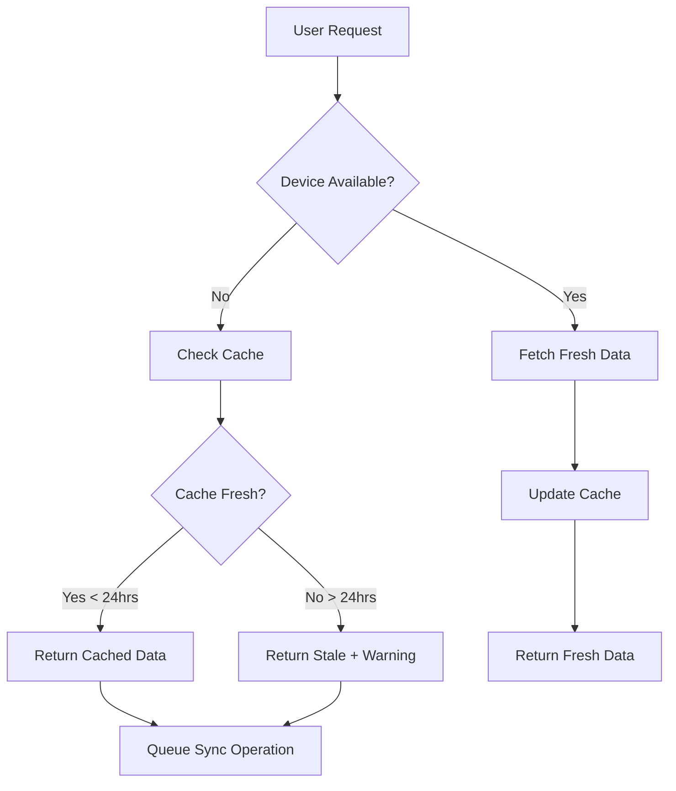
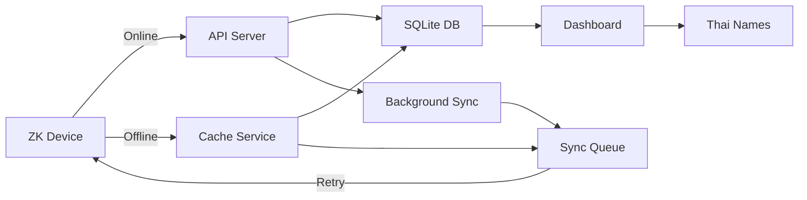

# 🏗️ System Architecture Documentation

## Table of Contents
1. [Overview](#overview)
2. [Offline Mode Architecture](#offline-mode-architecture)
3. [ZKTeco Device Connection](#zkteco-device-connection)
4. [Database & Cache Architecture](#database--cache-architecture)
5. [Integration Architecture](#integration-architecture)
6. [Performance Optimizations](#performance-optimizations)
7. [Reliability Features](#reliability-features)

## Overview

The Fingerprint Time Logger implements a sophisticated **offline-first architecture** designed to ensure continuous operation even when network connectivity or device availability is intermittent. This document provides a comprehensive explanation of the system's core components and their interactions.

## 📡 Offline Mode Architecture

### Core Components

#### 1. Error Classification System
The system uses a graduated error severity model to intelligently handle failures:

```python
class ErrorSeverity(Enum):
    INFORMATIONAL = 1  # Transient network issues
    WARNING = 2        # Minor connectivity problems
    RECOVERABLE = 3    # Temporary device failures
    CRITICAL = 4       # System degradation
    FATAL = 5         # Complete failure
```

**Key Benefits:**
- Nuanced error handling instead of binary success/failure
- Appropriate response strategies for different error types
- Reduced false alarms and unnecessary escalations

#### 2. Graduated Health States
Instead of binary online/offline states, the system maintains graduated health levels:

| State | Description | Functionality |
|-------|-------------|---------------|
| **HEALTHY** | All systems operational | Full functionality |
| **DEGRADED** | Minor issues detected | Full functionality with warnings |
| **UNSTABLE** | Significant issues | Reduced functionality |
| **CRITICAL** | Major failures | Emergency mode only |

#### 3. Cache Service Layer
Local SQLite caching provides data persistence during offline periods:

```python
# Cache attendance data when device offline
cache_service.cache_attendance_data(records, device_id)

# Retrieve cached data with freshness indicators
cached_data = cache_service.get_cached_attendance_data(device_id)
```

### Offline Operation Flow



### Cache Freshness Management

The system tracks data freshness with three states:
- **Fresh**: < 1 hour old
- **Recent**: 1-24 hours old
- **Stale**: > 24 hours old

## 🔌 ZKTeco Device Connection

### Connection Architecture

The system uses the `pyzk` library to communicate with ZKTeco biometric devices over TCP/IP:

```python
# Connection with optimized settings
zk = ZK(
    DEVICE_IP,           # Device IP address
    port=4370,          # Standard ZK port
    timeout=5,          # Short timeout for responsiveness
    force_udp=False,    # TCP for reliability
    ommit_ping=True     # Skip ping for faster connection
)
```

### Connection Management Features

#### 1. Retry Logic with Exponential Backoff
```python
MAX_RETRIES = 3
for attempt in range(MAX_RETRIES):
    try:
        conn = zk.connect()
        break
    except Exception as e:
        if attempt == MAX_RETRIES - 1:
            raise
        time.sleep(2 ** attempt)  # Exponential backoff: 1s, 2s, 4s
```

#### 2. Connection Pooling
The `ConnectionManager` service maintains persistent connections:
- **Connection Reuse**: Reduces connection overhead
- **Automatic Reconnection**: Self-healing on failure
- **Health Monitoring**: Regular connection health checks
- **Resource Management**: Proper cleanup of stale connections

#### 3. Device Time Synchronization
```python
def sync_device_time(conn):
    device_time = conn.get_time()
    server_time = datetime.now()
    time_diff = abs((device_time - server_time).total_seconds())
    
    if time_diff > 60:  # More than 1 minute off
        conn.disable_device()  # Prevent user punches during sync
        conn.set_time(server_time)
        conn.enable_device()   # Re-enable for normal operation
        return True, f"Time synced (was {time_diff:.1f}s off)"
```

### Data Retrieval Process

1. **Establish Connection**
   - TCP connection to device IP:4370
   - Timeout handling for unresponsive devices

2. **Authenticate**
   - Optional password authentication
   - Default password: 0

3. **Fetch Attendance Records**
   ```python
   attendance_records = conn.get_attendance()
   ```

4. **Process Records**
   - Convert device format to standardized format
   - Filter by date range if needed
   - Map employee IDs to Thai names

5. **Close Connection**
   - Proper disconnect to free device resources
   - Connection pooling for future requests

## 💾 Database & Cache Architecture

### Multi-Layer Storage Strategy

#### Layer 1: Primary Database (SQLite)

**Core Tables:**
```sql
-- Attendance records from fingerprint devices
CREATE TABLE attendance_records (
    id INTEGER PRIMARY KEY,
    employee_id VARCHAR(50),
    device_id INTEGER,
    timestamp DATETIME,
    punch_type INTEGER,  -- 0: Check-in, 1: Check-out
    sync_status VARCHAR(20),  -- pending, synced, failed
    created_locally BOOLEAN,
    created_at DATETIME
);

-- Employee master data
CREATE TABLE employees (
    id INTEGER PRIMARY KEY,
    employee_id VARCHAR(50) UNIQUE,
    name VARCHAR(100),
    department VARCHAR(100),
    is_active BOOLEAN DEFAULT true
);

-- Thai name mappings
CREATE TABLE employee_thai_names (
    id INTEGER PRIMARY KEY,
    badge_number VARCHAR(50) UNIQUE,
    thai_name VARCHAR(100),
    is_active BOOLEAN DEFAULT true,
    created_at DATETIME,
    updated_at DATETIME
);

-- ZKTeco device registry
CREATE TABLE devices (
    id INTEGER PRIMARY KEY,
    name VARCHAR(100),
    ip_address VARCHAR(45),
    port INTEGER DEFAULT 4370,
    is_active BOOLEAN DEFAULT true,
    last_sync DATETIME
);

-- Offline sync queue
CREATE TABLE sync_queue (
    id INTEGER PRIMARY KEY,
    operation_type VARCHAR(50),
    payload JSON,
    status VARCHAR(20),
    retry_count INTEGER DEFAULT 0,
    created_at DATETIME,
    next_retry DATETIME
);

-- Cache entries for offline data
CREATE TABLE cache_entries (
    id INTEGER PRIMARY KEY,
    cache_key VARCHAR(255) UNIQUE,
    cache_type VARCHAR(50),
    data JSON,
    created_at DATETIME,
    expires_at DATETIME
);
```

#### Layer 2: Cache Service

In-memory and persistent caching for offline resilience:

```python
class CacheService:
    def cache_attendance_data(self, records: List[Dict], device_id: int):
        """Store attendance records with metadata"""
        cache_entry = {
            "records": records,
            "cached_at": datetime.now().isoformat(),
            "record_count": len(records),
            "device_id": device_id
        }
        # Store in cache_entries table
        
    def get_cache_status(self) -> Dict[str, Any]:
        """Returns cache health metrics"""
        return {
            "active_entries": active_count,
            "expired_entries": expired_count,
            "estimated_size_bytes": total_size,
            "oldest_entry": oldest_timestamp
        }
```

#### Layer 3: Sync Queue

Manages pending operations during offline periods:

```python
class SyncQueueManager:
    def queue_attendance_sync(self, device_id: int, since: datetime):
        """Queue sync operation for when device returns online"""
        operation = {
            "type": "attendance_sync",
            "device_id": device_id,
            "since": since.isoformat(),
            "priority": "normal"
        }
        # Add to sync_queue table
        
    def process_pending_operations(self):
        """Process queue with retry logic"""
        pending = self.get_ready_operations()
        for operation in pending:
            try:
                self.process_operation(operation)
                self.mark_completed(operation.id)
            except RecoverableError:
                self.schedule_retry(operation.id)
            except FatalError:
                self.mark_failed(operation.id)
```

### Data Flow Architecture



### Cache Management Strategy

#### Freshness Tracking
Each cached entry includes comprehensive metadata:

```json
{
    "cache_key": "attendance_device_1",
    "cached_at": "2025-06-30T10:00:00",
    "expires_at": "2025-06-30T22:00:00",
    "freshness": "fresh",
    "source": "device",
    "record_count": 150,
    "checksum": "abc123..."
}
```

#### Intelligent Eviction Policies

1. **TTL-based Eviction**
   - Default: 24-hour expiration
   - Configurable per cache type
   - Automatic cleanup job

2. **Size-based Eviction**
   - Maximum cache size: 100MB
   - LRU (Least Recently Used) eviction
   - Preserves most recent data

3. **Priority-based Eviction**
   - Critical data retained longer
   - Manual entries prioritized
   - Device data secondary priority

### Conflict Resolution

When device returns online after offline period:

```python
class ConflictResolver:
    def resolve_attendance_conflicts(self, device_records, local_records):
        """Resolve conflicts between device and local data"""
        
        # Step 1: Compare timestamps
        conflicts = self.identify_conflicts(device_records, local_records)
        
        # Step 2: Apply merge strategy (device wins)
        for conflict in conflicts:
            if conflict.device_record.timestamp != conflict.local_record.timestamp:
                # Device data takes precedence
                self.update_local_record(conflict.local_record, conflict.device_record)
        
        # Step 3: Remove duplicates
        self.deduplicate_records()
        
        # Step 4: Log resolution
        self.log_conflict_resolution(conflicts)
```

## 🔄 Integration Architecture

### Background Services

```python
# Background sync service configuration
SYNC_INTERVAL = 120  # 2 minutes

class BackgroundSyncService:
    def start(self):
        """Start background sync thread"""
        while True:
            try:
                # Check device connectivity
                if self.is_device_online():
                    self.sync_attendance_data()
                else:
                    self.process_offline_queue()
            except Exception as e:
                self.handle_sync_error(e)
            time.sleep(SYNC_INTERVAL)
```

### API Layer Integration

**Attendance API with Offline Support:**
```python
@router.get("/api/attendance/")
async def get_attendance_records(
    include_offline: bool = True,
    max_age_hours: int = 24,
    db: Session = Depends(get_db)
):
    """Get attendance records with offline fallback"""
    
    try:
        # Try to get fresh data
        fresh_records = device_service.get_attendance()
        cache_service.cache_attendance_data(fresh_records)
        return {
            "records": fresh_records,
            "data_freshness": "fresh",
            "source": "device"
        }
    except DeviceOfflineError:
        if include_offline:
            # Return cached data
            cached = cache_service.get_cached_attendance_data()
            return {
                "records": cached["records"],
                "data_freshness": cached["freshness"],
                "cached_at": cached["cached_at"],
                "source": "cache"
            }
        raise
```

### Real-time Updates

WebSocket integration for live updates:

```javascript
// Client-side WebSocket handling
socket.on('attendance_update', function(data) {
    // Real-time attendance updates
    updateEmployeeGrid(data);
    
    // Update UI indicators
    updateDataFreshness(data.freshness);
    
    // Background cache update
    if (window.offlineManager) {
        window.offlineManager.updateCache(data);
    }
});

// Server-side emission
@socketio.on('connect')
def handle_connect():
    # Send initial data
    emit('attendance_update', get_current_attendance())
    
    # Join room for updates
    join_room('attendance_updates')
```

## 📊 Performance Optimizations

### Connection Efficiency

1. **Skip Unnecessary Operations**
   ```python
   zk = ZK(ip, ommit_ping=True)  # Skip ping check
   ```

2. **Connection Pooling**
   - Maintain pool of 3 connections
   - Reuse connections for 5 minutes
   - Health check every 30 seconds

3. **Timeout Optimization**
   - Initial connection: 5 seconds
   - Data operations: 10 seconds
   - Retry with backoff on failure

### Data Processing

1. **Incremental Sync**
   ```python
   # Only fetch new records since last sync
   last_sync = device.last_sync or datetime.min
   new_records = conn.get_attendance_after(last_sync)
   ```

2. **Batch Processing**
   - Process 1000 records at a time
   - Commit in transactions
   - Progress tracking for large datasets

3. **Pagination**
   ```python
   # API pagination for large datasets
   @router.get("/api/attendance/")
   async def get_attendance(skip: int = 0, limit: int = 100):
       return paginate(records, skip, limit)
   ```

### Cache Optimization

1. **Indexed Cache Entries**
   ```sql
   CREATE INDEX idx_cache_key ON cache_entries(cache_key);
   CREATE INDEX idx_cache_expires ON cache_entries(expires_at);
   ```

2. **Compressed Storage**
   - JSON compression for large datasets
   - Binary format for attendance records
   - Gzip compression for API responses

3. **Background Cleanup**
   ```python
   # Scheduled cleanup task
   @scheduler.task('interval', hours=6)
   def cleanup_expired_cache():
       db.query(CacheEntry).filter(
           CacheEntry.expires_at < datetime.now()
       ).delete()
   ```

## 🛡️ Reliability Features

### 1. Graceful Degradation
- System remains functional without device connectivity
- Cached data served with freshness indicators
- Manual entry options available offline

### 2. Automatic Recovery
- Self-healing connection management
- Automatic retry with exponential backoff
- Queue processing when connectivity restored

### 3. Data Integrity
- Transaction-based operations
- Checksum validation for cached data
- Audit trail for all modifications

### 4. User Transparency
- Clear indicators of data freshness
- Connection status visibility
- Sync progress notifications

### Error Handling Strategy

```python
try:
    # Primary operation
    data = device_service.get_data()
except DeviceOfflineError:
    # Fallback to cache
    data = cache_service.get_cached_data()
    notify_user("Using cached data")
except NetworkError as e:
    # Retry with backoff
    retry_with_backoff(e)
except FatalError as e:
    # Log and alert
    logger.error(f"Fatal error: {e}")
    alert_admin(e)
    raise
```

## Summary

This architecture ensures the Fingerprint Time Logger remains fully functional even in challenging network environments. The multi-layered approach with intelligent caching, graduated health states, and automatic recovery mechanisms provides a seamless experience for users while maintaining data integrity and system reliability.

The system is designed to:
- **Operate offline** for extended periods
- **Sync automatically** when connectivity returns
- **Maintain data integrity** through conflict resolution
- **Provide transparency** about data freshness
- **Scale efficiently** with performance optimizations