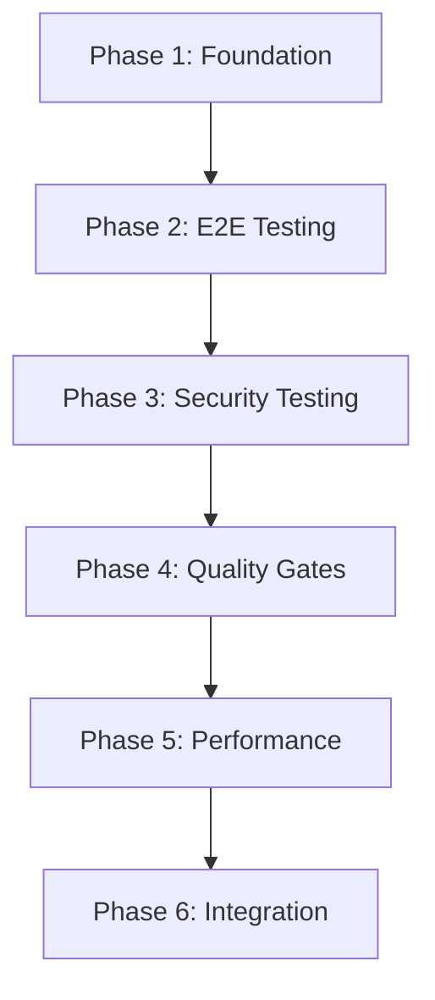

# Testing Architecture Overview

## Architecture Summary

The comprehensive testing enhancement builds upon your strong foundation of **106 tests with 100% critical module coverage**, extending it to enterprise-grade capabilities across multiple testing domains.

### Current Foundation ✅
- **Robust pytest infrastructure** with comprehensive fixtures
- **Factory Boy integration** for realistic test data generation
- **ZKTeco simulator** for device integration testing
- **SQLAlchemy in-memory testing** for fast execution
- **Coverage reporting** with quality gates
- **Docker integration** for containerized testing

### Enhanced Capabilities 🚀

#### 1. End-to-End Testing Framework
**Location**: `/tests/e2e/`
**Technology**: Playwright + Docker + AsyncIO

```python
# Complete user workflow testing
async def test_daily_attendance_workflow(authenticated_page, e2e_server_container):
    """Test complete daily attendance management workflow"""
    dashboard = DashboardPage(authenticated_page)

    # Navigate and verify initial state
    await dashboard.navigate_to("/")
    employee_count = await dashboard.get_employee_count()
    assert employee_count > 0

    # Simulate device punch and verify real-time update
    await simulate_device_punch(api_client, "0001")
    await wait_for_websocket_update(authenticated_page)

    # Verify dashboard reflects changes
    updated_status = await dashboard.get_last_update_time()
    assert "seconds ago" in updated_status
```

**Features**:
- **Real Browser Testing**: Chrome, Firefox, Safari compatibility
- **Page Object Pattern**: Maintainable test organization
- **WebSocket Testing**: Real-time update validation
- **Visual Regression**: Automated screenshot comparison
- **Performance Monitoring**: Page load time tracking

#### 2. Security Testing Framework
**Location**: `/tests/security/`
**Technology**: Custom framework + Bandit + Safety + OWASP

```python
async def test_sql_injection_protection():
    """Comprehensive SQL injection testing"""
    scanner = SecurityScanner(security_client)

    # Test all input fields with malicious payloads
    vulnerabilities = await scanner.test_endpoint_security(
        "/api/employees/",
        method="POST",
        data={"name": "'; DROP TABLE employees; --"}
    )

    # Ensure no SQL injection vulnerabilities
    sql_vulns = [v for v in vulnerabilities if v.category == "Injection"]
    assert len(sql_vulns) == 0, f"SQL injection vulnerabilities found: {sql_vulns}"
```

**Security Coverage**:
- **Input Validation**: SQL injection, XSS, command injection
- **Authentication**: Session management, privilege escalation
- **Data Exposure**: Information disclosure, verbose errors
- **Infrastructure**: Dependency vulnerabilities, container security

#### 3. Quality Automation Framework
**Location**: `/quality/quality_gates.py`
**Technology**: Custom quality gates + radon + flake8 + black

```python
def run_quality_gates():
    """Automated quality assessment with reporting"""
    runner = QualityGateRunner(project_root)
    report = runner.run_all_gates()

    # Quality metrics validation
    assert report.overall_level in [QualityLevel.EXCELLENT, QualityLevel.GOOD]
    assert len(report.failed_gates) == 0

    # Generate comprehensive reports
    runner.generate_report_html(report, "quality_report.html")
    runner.generate_report_json(report, "quality_report.json")
```

**Quality Gates**:
- **Code Coverage**: ≥85% with branch coverage
- **Code Complexity**: Cyclomatic complexity <10
- **Code Style**: PEP 8 compliance + black formatting
- **Documentation**: ≥75% docstring coverage
- **Test Quality**: >90% test success rate

#### 4. Performance Testing Framework
**Technology**: pytest-benchmark + Locust + memory-profiler

```python
@pytest.mark.performance
def test_api_performance_benchmarks(benchmark):
    """Benchmark critical API endpoints"""

    # Benchmark employee API performance
    result = benchmark(test_get_employees_endpoint)
    assert result.stats.mean < 0.2  # 200ms threshold

    # Memory usage validation
    @profile
    def memory_test():
        # Test with large dataset
        return process_large_attendance_data()

    memory_usage = memory_test()
    assert max(memory_usage) < 500  # 500MB threshold
```

## Implementation Architecture

### Phase-Based Implementation


### Technology Stack Integration
```yaml
Testing_Layers:
  Unit_Tests:
    framework: pytest
    coverage: Factory Boy + fixtures
    execution: parallel with pytest-xdist

  Integration_Tests:
    framework: pytest + SQLAlchemy
    database: in-memory SQLite
    mocking: ZKTeco simulator

  E2E_Tests:
    framework: Playwright + pytest-playwright
    browsers: Chrome, Firefox, Safari
    environment: Docker containers

  Security_Tests:
    static: bandit + safety + semgrep
    dynamic: custom vulnerability scanner
    containers: OWASP ZAP integration

  Performance_Tests:
    micro: pytest-benchmark
    load: Locust
    profiling: py-spy + memory-profiler
```

### File Organization Strategy
```
tests/
├── unit/                    # Existing unit tests (106 tests)
├── integration/             # Existing integration tests
├── e2e/                     # New: Browser automation tests
│   ├── conftest.py         # E2E fixtures and page objects
│   ├── test_workflows.py   # Complete user scenarios
│   └── page_objects/       # Page object model classes
├── security/                # New: Security vulnerability testing
│   ├── conftest.py         # Security testing framework
│   ├── test_injection.py   # Injection attack testing
│   └── test_auth.py        # Authentication security
├── performance/             # New: Performance and load testing
│   ├── conftest.py         # Performance test configuration
│   ├── test_benchmarks.py  # Micro-benchmarks
│   └── locustfile.py       # Load testing scenarios
└── fixtures/                # Shared test data and factories
    ├── test_factories.py    # Existing Factory Boy classes
    └── zkteco_simulator.py  # Existing device simulator
```

## Quality Gates and Validation

### Automated Quality Pipeline
```yaml
CI_CD_Pipeline:
  Quick_Validation:
    - Code formatting (black, isort)
    - Basic linting (flake8)
    - Fast unit tests

  Comprehensive_Testing:
    - Full unit test suite
    - Integration tests
    - API endpoint testing
    - Security vulnerability scanning

  Quality_Gates:
    - Coverage analysis (≥85%)
    - Complexity analysis (<10)
    - Documentation coverage (≥75%)
    - Performance benchmarks

  Deployment_Readiness:
    - All tests passing
    - Security vulnerabilities addressed
    - Quality gates satisfied
    - Performance thresholds met
```

### Success Metrics
```yaml
Testing_KPIs:
  Coverage_Metrics:
    line_coverage: "≥85%"
    branch_coverage: "≥80%"
    critical_path_coverage: "100%"

  Quality_Metrics:
    test_success_rate: "≥98%"
    flaky_test_rate: "≤2%"
    execution_time: "≤5 minutes"

  Security_Metrics:
    critical_vulnerabilities: "0"
    high_vulnerabilities: "0"
    dependency_updates: "monthly"

  Performance_Metrics:
    api_response_time: "≤200ms"
    page_load_time: "≤2 seconds"
    concurrent_users: "≥100"
```

## Integration with Existing Workflow

### Development Workflow Enhancement
```bash
# Enhanced developer workflow
git checkout -b feature/new-functionality

# Quick feedback loop (2-3 minutes)
./scripts/run_tests.sh --quick

# Comprehensive validation (5-8 minutes)
./scripts/run_comprehensive_tests.sh

# Security and quality checks (3-5 minutes)
./scripts/run_comprehensive_tests.sh --security

git commit -m "feat: implement functionality with comprehensive testing"
git push origin feature/new-functionality
```

### CI/CD Integration
- **Pull Request**: Quick validation + comprehensive tests
- **Main Branch**: Full test suite + E2E + security + performance
- **Release Branch**: Complete validation + deployment readiness

### Backward Compatibility
- **Existing tests preserved**: All 106 current tests continue to function
- **Gradual enhancement**: Each phase adds capability without disruption
- **Performance maintained**: Test execution time optimized through parallelization
- **Tooling familiar**: Builds upon existing pytest/Factory Boy foundation

## Performance Considerations

### Execution Optimization
```yaml
Parallel_Execution:
  unit_tests: pytest-xdist (4-8 workers)
  integration_tests: pytest-xdist (2-4 workers)
  e2e_tests: playwright parallel (2-3 browsers)

Resource_Management:
  memory_optimization: in-memory databases + cleanup fixtures
  docker_optimization: layered caching + minimal images
  artifact_management: automatic cleanup + retention policies

Scalability:
  test_sharding: distribute across CI runners
  smart_selection: run only affected tests for PRs
  caching: pip dependencies + Docker layers
```

### Resource Requirements
```yaml
Development_Environment:
  minimum_requirements:
    memory: 8GB RAM
    storage: 2GB for test artifacts
    cpu: 4 cores for parallel execution

CI_CD_Environment:
  github_actions:
    memory: 7GB available
    storage: 14GB SSD
    parallel_jobs: 20 concurrent
    timeout: 6 hours total
```

## Migration Strategy

### Phase 1: Foundation (Week 1-2)
- Install enhanced dependencies
- Upgrade test fixtures and factories
- Implement performance profiling
- Setup CI/CD pipeline

### Phase 2: E2E Framework (Week 3-4)
- Install Playwright and browser automation
- Create page object model
- Implement core user workflow tests
- Setup Docker test environments

### Phase 3: Security Testing (Week 5-6)
- Install security scanning tools
- Create vulnerability testing framework
- Implement automated security tests
- Integrate with CI/CD security gates

### Phase 4: Quality Gates (Week 7-8)
- Implement quality metrics framework
- Create automated quality reporting
- Setup quality gate enforcement
- Integrate with development workflow

### Phase 5: Performance Testing (Week 9-10)
- Setup performance testing framework
- Implement load testing scenarios
- Create performance monitoring
- Establish performance baselines

### Phase 6: Integration (Week 11-12)
- Complete CI/CD integration
- Finalize documentation
- Developer training and adoption
- Production deployment validation

## Risk Mitigation

### Technical Risks
- **Test Flakiness**: Robust wait strategies, retry mechanisms, isolation
- **Performance Impact**: Resource monitoring, execution optimization
- **Maintenance Overhead**: Automated maintenance, clear documentation

### Operational Risks
- **Adoption Resistance**: Gradual introduction, clear benefits, training
- **Resource Costs**: Cost monitoring, optimization strategies
- **Knowledge Concentration**: Documentation, cross-training

## Success Validation

### Completion Criteria
- ✅ All 106 existing tests continue to pass
- ✅ 15+ E2E workflow tests implemented
- ✅ Zero critical/high security vulnerabilities
- ✅ 85%+ code coverage maintained
- ✅ <5 minute total test execution time
- ✅ Comprehensive CI/CD pipeline operational

### Quality Assurance
- **Automated validation** of all testing components
- **Performance benchmarking** for regression detection
- **Security scanning** integrated into development workflow
- **Quality reporting** with actionable insights

This architecture provides a systematic, enterprise-grade enhancement to your testing infrastructure while preserving the reliability and performance of your existing 106-test foundation.